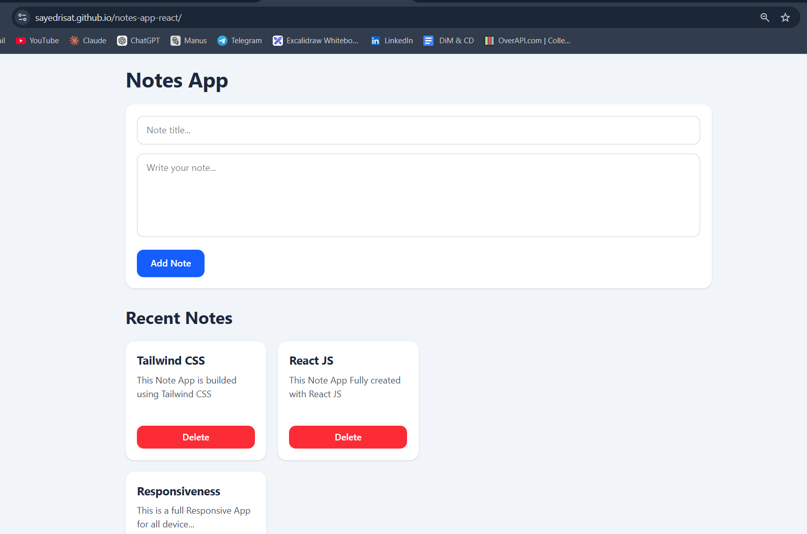

# Notes App

A modern Notes App built with React and Tailwind CSS.

## Live Demo

🔗 https://sayedrisat.github.io/notes-app-react/

## Features

* Create notes instantly
* Delete notes
* Responsive design
* React State Management (`useState`)
* Dynamic rendering with `map()`
* Clean Tailwind CSS UI

## Tech Stack

* React
* Vite
* Tailwind CSS
* JavaScript

## Screenshots



## Installation

Clone the repository:

```bash
git clone https://github.com/sayedrisat/notes-app-react.git
```

Navigate to the project:

```bash
cd notes-app-react
```

Install dependencies:

```bash
npm install
```

Run locally:

```bash
npm run dev
```

## Learning Goals

This project was created to practice:

* React fundamentals
* useState
* Two-way binding
* Form handling
* Array methods (`map`, `filter`)
* Component-based UI development

## Future Improvements

* Edit notes
* Search notes
* Local Storage persistence
* Note categories
* Dark mode

## Author

Sayed Risat

GitHub: https://github.com/sayedrisat

LinkedIn: https://www.linkedin.com/in/sayedrisat/


# React + Vite

This template provides a minimal setup to get React working in Vite with HMR and some ESLint rules.

Currently, two official plugins are available:

- [@vitejs/plugin-react](https://github.com/vitejs/vite-plugin-react/blob/main/packages/plugin-react) uses [Oxc](https://oxc.rs)
- [@vitejs/plugin-react-swc](https://github.com/vitejs/vite-plugin-react/blob/main/packages/plugin-react-swc) uses [SWC](https://swc.rs/)

## React Compiler

The React Compiler is not enabled on this template because of its impact on dev & build performances. To add it, see [this documentation](https://react.dev/learn/react-compiler/installation).

## Expanding the ESLint configuration

If you are developing a production application, we recommend using TypeScript with type-aware lint rules enabled. Check out the [TS template](https://github.com/vitejs/vite/tree/main/packages/create-vite/template-react-ts) for information on how to integrate TypeScript and [`typescript-eslint`](https://typescript-eslint.io) in your project.
